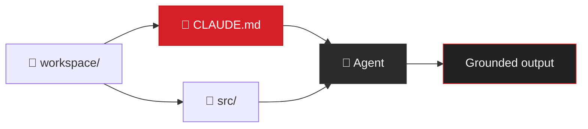

<style>
:root {
  --slidev-theme-primary: #D61F26;
  --slidev-theme-background: #1A1A1A;
}
.slidev-layout {
  background: #1A1A1A !important;
  color: #F5F5F5;
}
.slidev-layout h1 {
  color: #F5F5F5 !important;
}
.slidev-layout h3 {
  color: #F5F5F5 !important;
}
.slidev-layout a {
  color: #D61F26 !important;
}
.slidev-layout code {
  background: #222222 !important;
}
.slidev-layout pre {
  background: #222222 !important;
  border: 1px solid #353535 !important;
}
.dh-accent { color: #D61F26; }
.dh-surface { background: #222222; border: 1px solid #353535; border-radius: 8px; }
.dh-num { color: #D61F26; opacity: 0.7; }
</style>

# Agentic Live Coding Session

<div class="text-2xl mt-4 opacity-80">From chat to grounded workflow</div>

<div class="abs-bl mx-14 my-12 flex flex-col gap-2">
  <div class="text-lg opacity-60">Juan Cruz Fortunatti</div>
  <div class="text-sm opacity-40">Delivery Hero — April 2026</div>
</div>


<!--
Keep this up while people settle in. No rush.
-->

---
layout: default
---

# What we'll build today

<div class="text-lg opacity-70 mb-6">You don't need to have coded before to get value from this.</div>

<div class="flex flex-col gap-0 mt-2 ml-8">

<div class="flex items-start gap-4">
  <div class="flex flex-col items-center">
    <div class="w-8 h-8 rounded-full bg-[#D61F26] text-white text-sm font-bold flex items-center justify-center">1</div>
    <div class="w-0.5 h-8 bg-[#353535]"></div>
  </div>
  <div class="pt-1">
    <div class="font-bold">Raw text → structured data</div>
    <div class="text-sm opacity-50">Paste a product page, get a reusable schema</div>
  </div>
</div>

<div class="flex items-start gap-4">
  <div class="flex flex-col items-center">
    <div class="w-8 h-8 rounded-full bg-[#D61F26] text-white text-sm font-bold flex items-center justify-center">2</div>
    <div class="w-0.5 h-8 bg-[#353535]"></div>
  </div>
  <div class="pt-1">
    <div class="font-bold">Instructions that persist</div>
    <div class="text-sm opacity-50">CLAUDE.md - the workspace memory</div>
  </div>
</div>

<div class="flex items-start gap-4">
  <div class="flex flex-col items-center">
    <div class="w-8 h-8 rounded-full bg-[#D61F26] text-white text-sm font-bold flex items-center justify-center">3</div>
    <div class="w-0.5 h-8 bg-[#353535]"></div>
  </div>
  <div class="pt-1">
    <div class="font-bold">A HTML UI from a design system</div>
    <div class="text-sm opacity-50">CAPE guidelines skill → comparison page</div>
  </div>
</div>

<div class="flex items-start gap-4">
  <div class="flex flex-col items-center">
    <div class="w-8 h-8 rounded-full bg-[#D61F26] text-white text-sm font-bold flex items-center justify-center">4</div>
    <div class="w-0.5 h-8 bg-[#353535]"></div>
  </div>
  <div class="pt-1">
    <div class="font-bold">Self-verifying output</div>
    <div class="text-sm opacity-50">Playwright screenshots → feedback loop</div>
  </div>
</div>

<div class="flex items-start gap-4">
  <div class="flex flex-col items-center">
    <div class="w-8 h-8 rounded-full bg-[#D61F26] text-white text-sm font-bold flex items-center justify-center">5</div>
    <div class="w-0.5 h-8 bg-[#353535]"></div>
  </div>
  <div class="pt-1">
    <div class="font-bold">Layered constraints</div>
    <div class="text-sm opacity-50">Root context → local context → feature spec</div>
  </div>
</div>

<div class="flex items-start gap-4">
  <div class="flex flex-col items-center">
    <div class="w-8 h-8 rounded-full bg-[#D61F26] text-white text-sm font-bold flex items-center justify-center">6</div>
  </div>
  <div class="pt-1">
    <div class="font-bold">Delegation</div>
    <div class="text-sm opacity-50">Kick off agents, watch them build</div>
  </div>
</div>

</div>

<!--
Frame this as a journey. "We'll start with nothing and end with agents building a real app."
Point out that each step builds on the last — it's not a grab bag.
-->

---
layout: default
---

# Markdown + frontmatter — 30 seconds

<div class="grid grid-cols-2 gap-8 mt-8">

<div>

### What you already know

```
# A heading
- A bullet point
- Another one

**Bold text**
```

<div class="text-sm opacity-60 mt-2">Markdown — plain text with lightweight formatting</div>

</div>

<div>

### What we're adding

```yaml
---
name: "Roborock S8 MaxV Ultra"
price: 1799.99
suction_power: "10000 Pa"
navigation: "LiDAR + camera"
rating: 4.6
---

# Roborock S8 MaxV Ultra

The flagship model with...
```

<div class="text-sm opacity-60 mt-2">Frontmatter — structured data at the top of the file</div>

</div>

</div>

<div class="mt-6 text-center opacity-60">Human-readable. Machine-parseable. Version-controllable.</div>

<!--
This kills the "what is frontmatter?" confusion before it derails anything.
30 seconds max. Move on.
-->

---
layout: default
---

# The instruction layer

<div class="flex justify-center mt-8">



</div>

<div class="grid grid-cols-3 gap-6 mt-8 text-center">
  <div>
    <div class="text-lg font-bold opacity-90">The model</div>
    <div class="text-sm opacity-50">General capability</div>
  </div>
  <div>
    <div class="text-lg font-bold opacity-90">The workspace</div>
    <div class="text-sm opacity-50">Your data + your rules</div>
  </div>
  <div>
    <div class="text-lg font-bold opacity-90">The output</div>
    <div class="text-sm opacity-50">Grounded, not generic</div>
  </div>
</div>

<div class="text-center mt-6 text-lg opacity-70">The agent isn't useful because it's smart — it's useful because of what you put in the workspace.</div>

<!--
This is the conceptual anchor. Pause here. Let the room absorb.
"Everything we did in the first half was about building this workspace. Now it's loaded."
-->

---
layout: default
---

# Growing code around constraints

<div class="flex flex-col items-center justify-center h-full gap-6 -mt-4">


<div class="text-lg opacity-70 text-center">A young tree doesn't grow straight on its own.<br/>The stakes aren't a cage — they're the shape you want.</div>

</div>

<!--
Let the image land. Don't explain immediately.
"What does this have to do with code? Next slide."
-->

---
layout: default
---

# Growing code around constraints

<div class="grid grid-cols-2 gap-12 mt-8 items-center">

<div class="flex flex-col items-center gap-4">

```
    🌱
    │
  ┌─┤─┐    ← stake (CLAUDE.md)
  │ │ │
  │ │ │
──┴─┴─┴──
```

<div class="text-sm opacity-60 text-center mt-2">A plant grows around a stake.<br/>The stake isn't a cage — it's the shape you want.</div>

</div>

<div>

```
project/
├── CLAUDE.md          ← root context
├── src/
│   ├── CLAUDE.md      ← component rules
│   └── components/
├── data/
│   ├── CLAUDE.md      ← schema rules
│   └── products/
└── specs/
    └── browser.md     ← feature spec
```

<div class="text-sm opacity-60 mt-4">Three layers of specificity:</div>

<div class="text-sm mt-2">

- **Root** — what this project is, how it works
- **Local** — what belongs here, what patterns to follow
- **Spec** — what to build, acceptance criteria

</div>

</div>

</div>

<!--
The botany analogy. "Constraints aren't limiting the agent — they're directing its growth."
This lands right before delegation. People need to understand why the structure matters
before watching agents build inside it.
-->

---
layout: default
---

<div class="flex flex-col items-center justify-center h-full gap-6">


<div class="text-4xl font-bold">Thank you</div>

<div class="opacity-60 text-lg">Juan Cruz Fortunatti</div>

<div class="text-sm opacity-50 mt-8 text-center">
  Raw text → structured data → persistent workflow → agents building a real app.<br/><br/>
  <span class="dh-accent">The real work is building a shared language with your agent.</span>
</div>

</div>

<!--
Clean close. Let the quote breathe. Open for questions.
-->
